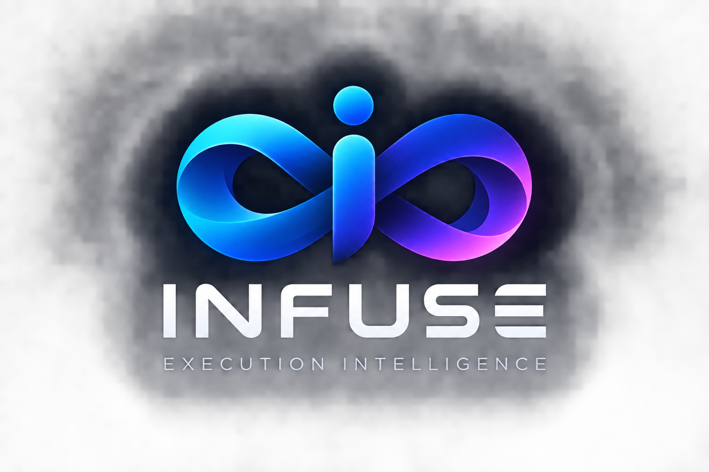
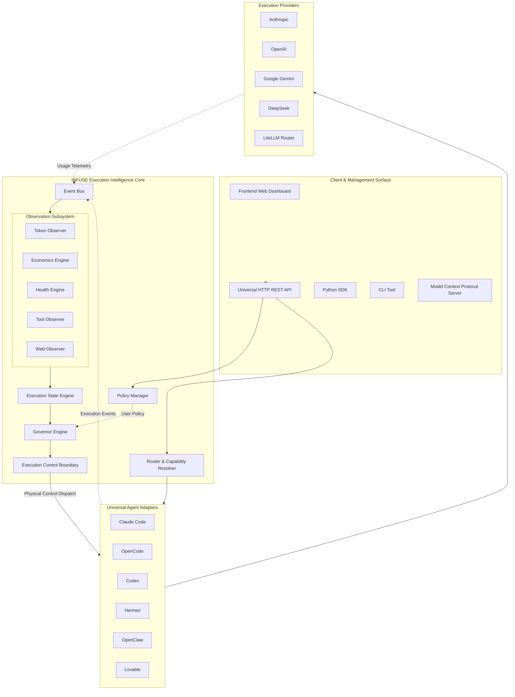

<p align="center">
  
</p>

<h1 align="center">INFUSE</h1>

<h3 align="center">Execution Intelligence & Governance for Autonomous AI Agents</h3>

<p align="center">
  <strong>Observe execution. Understand state. Regulate what happens next.</strong>
</p>

<p align="center">
  <a href="https://github.com/adorbistech/infuse"></a>
  <a href="https://github.com/adorbistech/infuse/releases"></a>
  <a href="docs/RELEASE_FREEZE.md"></a>
  <a href="LICENSE"></a>
  <a href="pyproject.toml"></a>
  <a href="docs/RELEASE_FREEZE.md"></a>
</p>

---

> ⭐ **If INFUSE helps you observe, optimize, or govern autonomous AI agents, please [star the repository on GitHub](https://github.com/adorbistech/infuse) and follow the project.**

---

## What is INFUSE?

**INFUSE** is an independent, provider-agnostic, agent-agnostic, and runtime-agnostic **execution intelligence and governance layer** for autonomous AI agents.

Think of it using the physical electrical analogy:

```text
┌─────────────────────────┐
│     Autonomous Agent    │  ◄── The autonomous device
└────────────┬────────────┘
             │
             ▼
┌─────────────────────────┐
│         INFUSE          │  ◄── The voltage regulator
└────────────┬────────────┘
             │
             ▼
┌─────────────────────────┐
│ AI Infrastructure & APIs│  ◄── The electrical power source
└─────────────────────────┘
```

> **The agent is the autonomous device.**  
> **INFUSE is the voltage regulator.**  
> **AI providers and model APIs are the execution source.**

INFUSE wraps around autonomous agents (such as Claude Code, OpenCode, Codex, Hermes, OpenClaw, or custom agents) and model providers (OpenAI, Anthropic, Google Gemini, DeepSeek, LiteLLM) to provide **continuous real-time observability, state understanding, and closed-loop execution governance**.

```text
                                  ┌────────────────────────┐
                                  │      USER POLICY       │
                                  │ (Budgets, Limits, SLAs)│
                                  └───────────┬────────────┘
                                              │
                                              ▼
┌──────────────────┐               ┌──────────────────────┐               ┌──────────────────┐
│                  │  Telemetry    │                      │  Dispatched   │                  │
│ Autonomous Agent │ ────────────► │        INFUSE        │ ────────────► │   AI Providers   │
│ (Claude, Codex,  │ ◄──────────── │ Execution Regulator  │ ◄──────────── │ (Anthropic, OAI, │
│  OpenCode, etc.) │    Control    │                      │   Responses   │  Gemini, etc.)   │
└──────────────────┘               └──────────────────────┘               └──────────────────┘
```

### What INFUSE Does
- **Observes execution in real time:** Captures token velocity, cost burn, provider health, tool calling cycles, and web operations.
- **Understands execution health:** Synthesizes multi-stream telemetry into 5 canonical execution states.
- **Enforces user-defined policies:** Applies budgets, latency caps, token limits, and failure thresholds without hardcoded business rules.
- **Regulates execution dynamically:** Issues canonical Governor actions (`CONTINUE`, `OPTIMIZE`, `ESCALATE`, `DOWNGRADE`, `SWITCH`, `THROTTLE`, `STOP`).
- **Dispatches through physical control boundaries:** Translates governance decisions safely into what the underlying runtime actually supports.

### What INFUSE Does Not Do
- **Does not replace agent reasoning:** The agent remains the decision-maker for its task.
- **Does not replace planning or memory:** INFUSE regulates execution economics and health; it does not dictate agent logic.
- **Does not train or host models:** INFUSE routes and mediates; it is not a GPU cluster or model trainer.
- **Does not hard-code business logic:** Every threshold and limit is configured via dynamic policy.

---

## The Problem with Autonomous Execution

When AI agents run autonomously in production, traditional API gateways and pre-execution routers fall short:

1. **Unbounded Cost & Runaway Loops:** An agent caught in a recursive debug loop or reasoning trap can burn thousands of dollars in minutes without real-time intervention.
2. **Pre-Execution vs. In-Flight Reality:** Pre-request routing only inspects the initial prompt. It cannot react when an agent’s 40th step suddenly degrades in output quality or exhausts provider rate limits.
3. **Provider Degeneracy & Outages:** Upstream provider latency spikes, rate limits, or context window overflow require intelligent in-flight failover, model downgrading, or throttling.
4. **Tool & Web Anomalies:** Repetitive failed tool invocations or abnormal web scraping bursts need automated detection and circuit breaking.
5. **Lack of Uniform Governance:** Different agents (Claude Code, OpenCode, custom orchestrators) run with inconsistent safety rails, incompatible telemetry, and no centralized budget control.

---

## The INFUSE Model: Observe → Understand → Regulate

Most execution routers make a **one-time routing decision before execution begins**. INFUSE operates **during execution** as a continuous closed loop:

```text
   ┌──────────────────────────────────────────────────────────────┐
   │                          1. OBSERVE                          │
   │  Capture token usage, economics, health, tools, and web ops  │
   └──────────────────────────────┬───────────────────────────────┘
                                  │
                                  ▼
   ┌──────────────────────────────────────────────────────────────┐
   │                        2. UNDERSTAND                         │
   │  Synthesize signals into Canonical Execution State Engine    │
   └──────────────────────────────┬───────────────────────────────┘
                                  │
                                  ▼
   ┌──────────────────────────────────────────────────────────────┐
   │                         3. REGULATE                          │
   │  Evaluate policy with Governor & Dispatch via Control Boundary│
   └──────────────────────────────────────────────────────────────┘
```

1. **OBSERVE:** Modular, non-intrusive observers monitor token velocity, cost accumulation, upstream error rates, tool call frequency, and HTTP latency.
2. **UNDERSTAND:** The **Execution State Engine** analyzes normalized telemetry against historical trends to determine the live execution state (`NORMAL`, `COST_PRESSURE`, `RUNAWAY`, `QUALITY_DEGRADED`, `PROVIDER_CONSTRAINED`).
3. **REGULATE:** The **Governor Engine** (the sole control authority) evaluates effective policies against the current state and emits an authoritative action (`CONTINUE`, `OPTIMIZE`, `ESCALATE`, `DOWNGRADE`, `SWITCH`, `THROTTLE`, `STOP`). The **Execution Control Boundary** translates this decision into the physical capabilities supported by the executing agent runtime.

---

## Architecture



---

## Why INFUSE?

| Property | Benefit |
|---|---|
| **Provider-Agnostic** | Seamlessly connects to OpenAI, Anthropic, Google Gemini, DeepSeek, and LiteLLM without vendor lock-in. |
| **Agent-Agnostic** | Unifies governance across Claude Code, OpenCode, Codex, Hermes, OpenClaw, Lovable, and custom agent harnesses. |
| **Runtime-Agnostic** | Runs as a standalone HTTP server, inside Docker/Kubernetes, via Python SDK, CLI, or as an MCP server. |
| **Policy-Driven** | Zero hard-coded rules. Budgets, rate limits, token thresholds, and failovers are completely externalized in declarative policy. |
| **Separation of Concerns** | Observers produce factual evidence. The Governor makes decisions. The Control Boundary handles physical mechanics. |
| **Glass-Box Observability** | Immutable event streams give you complete auditability of every token, tool call, error, and state transition. |
| **Zero Overhead Fallback** | When execution is healthy (`NORMAL`), requests flow through with sub-millisecond mediation overhead. |

---

## What Can INFUSE Observe?

INFUSE includes five dedicated observation engines that fan out from an asynchronous, lock-free **Event Bus**:

| Observation Engine | Signals Monitored | Detection Capabilities |
|---|---|---|
| **Token Observer** | Prompt tokens, completion tokens, cached token reuse, velocity (tokens/sec) | Context window saturation, sudden token acceleration |
| **Economics Engine** | Real-time dollar burn rate, cumulative session spend, budget consumption % | Budget ceiling alerts, projected cost overruns |
| **Health Engine** | Provider HTTP 429/5xx errors, timeouts, latency distributions, retry counts | Degraded provider health, rate-limit storms, network failovers |
| **Tool Activity Observer**| Tool invocation frequency, argument repetition, failure rate, execution duration | Infinite tool loops, recurring failed tool executions |
| **Web Activity Observer** | Outbound HTTP requests, bytes transferred, status codes, domain targets | Abnormal web scraping volume, unauthorized domain calls |

---

## The Governance Model

A foundational architectural invariant of INFUSE is **strict separation of authority**:

```text
User Policy
    ↓
Execution State
    ↓
Governor (Sole Control Authority)
    ↓
Control Decision
    ↓
Execution Control Boundary (Capability Translation)
    ↓
Agent Runtime / Model Provider
```

1. **Observers NEVER govern:** Observers only record facts and compute state. They cannot pause, switch, or terminate an execution.
2. **Governor is the SOLE authority:** The Governor evaluates state against policy and selects the required action.
3. **Control Boundary bridges theory and reality:** If the Governor orders `THROTTLE` but an agent runtime only supports `CANCEL`, the Execution Control Boundary gracefully maps the action to the runtime's declared capabilities (`supports_cancel`, `supports_throttle`, `supports_next_step_switch`, `supports_terminate`).

---

## Canonical Execution States

INFUSE normalizes all telemetry into **5 canonical execution states**:

| Execution State | Definition & Triggers | Typical Governor Response |
|---|---|---|
| `NORMAL` | Execution within all policy budget, latency, and health parameters. | `CONTINUE` |
| `COST_PRESSURE` | Spend or token rate approaching configured soft warning limits. | `OPTIMIZE` (e.g. compress context, lower max tokens) |
| `RUNAWAY` | Exponential token acceleration, infinite tool loops, or hard budget breach. | `THROTTLE` or `STOP` (circuit breaker) |
| `QUALITY_DEGRADED` | High tool failure rate, repetitive outputs, or invalid structured schema. | `ESCALATE` or `DOWNGRADE` |
| `PROVIDER_CONSTRAINED`| Upstream 429 rate limits, server 503s, or severe latency spikes. | `SWITCH` (seamless provider failover) |

---

## Canonical Governor Actions

When state or policy dictates an intervention, the Governor emits one of **7 canonical actions**:

| Governor Action | Operational Purpose |
|---|---|
| `CONTINUE` | Allow execution to proceed without alteration. |
| `OPTIMIZE` | Adjust generation parameters (reduce temperature, truncate history, enable caching). |
| `ESCALATE` | Raise execution to a more capable model or notify human supervisors. |
| `DOWNGRADE` | Switch to a smaller, more cost-effective model to preserve budget. |
| `SWITCH` | Fail over immediately to an alternative provider/model due to upstream constraints. |
| `THROTTLE` | Introduce pacing delay between steps to respect provider rate limits. |
| `STOP` | Immediately halt execution to prevent runaway costs or systemic failures. |

---

## Agent & Provider Integrations

INFUSE provides modular adapters conforming to the `UniversalAgentAdapter` contract:

| Agent / Subsystem | Integration Type | Status | Features Supported |
|---|---|---|---|
| **Universal Agent Adapter** | Core Interface | `VERIFIED` | Full lifecycle, event mapping, capability discovery |
| **Claude Code** | Native CLI / Process | `VERIFIED` | Stream interception, token observation, safe cancellation |
| **OpenCode** | Subprocess / API | `VERIFIED` | Step-boundary switching, tool monitoring, telemetry |
| **Codex** | Code Generation Harness | `VERIFIED` | Context window monitoring, cost tracking, execution limits |
| **Hermes** | Autonomous Agent Adapter | `VERIFIED` | Tool cycle tracking, web observer integration |
| **OpenClaw** | Crawling / Web Agent | `VERIFIED` | Web activity telemetry, byte transfer limits, domain filtering |
| **Lovable** | Web / Full-Stack Harness | `VERIFIED` | Frontend-backend lifecycle coordination |
| **LiteLLM Substrate** | Provider Router | `VERIFIED` | Multi-model routing (OpenAI, Anthropic, Gemini, DeepSeek) |

---

## Four Universal Interfaces — One Core

Whether you interact via REST, Python, CLI, or MCP, all interfaces speak to the exact same execution engine:

```text
  ┌────────────┐   ┌────────────┐   ┌────────────┐   ┌────────────┐
  │  HTTP API  │   │ Python SDK │   │  CLI Tool  │   │ MCP Server │
  │ (Port 8000)│   │(InfuseClient)  │ ('infuse') │   ('infuse-mcp')
  └─────┬──────┘   └─────┬──────┘   └─────┬──────┘   └─────┬──────┘
        │                │                │                │
        └────────────────┼────────────────┼────────────────┘
                         ▼
        ┌─────────────────────────────────┐
        │       INFUSE Unified Core       │
        └─────────────────────────────────┘
```

---

## Quick Start

### Prerequisites
- Python `>= 3.10` (Supports 3.10, 3.11, 3.12, 3.13, 3.14)
- Node.js `>= 18` (Optional, only for building web dashboard)

### 1. Installation

Clone the repository and install `infuse-ai`:

```bash
git clone https://github.com/adorbistech/infuse.git
cd infuse

# Install in editable mode
pip install -e .
```

### 2. Start the Production Server

```bash
# Launch the INFUSE HTTP API server on port 8000
infuse-server
```

You should see:
```text
INFO:     INFUSE Production API Server starting on http://0.0.0.0:8000
INFO:     Loaded default governance policy: pol_default
INFO:     Application startup complete.
```

### 3. Verify Health & Readiness

```bash
curl http://localhost:8000/health
```

Output:
```json
{"status":"OK","version":"0.1.0","schema_version":"1.0.0","uptime_seconds":5.2}
```

### 4. Execute a Governed Task via HTTP API

```bash
curl -X POST http://localhost:8000/v1/execute \
  -H "Content-Type: application/json" \
  -d '{
    "request_id": "req_quickstart_001",
    "task": {
      "task_id": "task_auth_refactor",
      "description": "Refactor JWT middleware",
      "workload_hint": "coding"
    },
    "request": {
      "messages": [{"role": "user", "content": "Refactor JWT auth module for security."}],
      "parameters": {"temperature": 0.2}
    },
    "requirements": {
      "preferred_providers": ["MockProvider"]
    },
    "execution_context": {
      "agent_id": "OpenCode",
      "session_id": "sess_quickstart"
    }
  }'
```

Response:
```json
{
  "execution_id": "exec_d78a9c21",
  "request_id": "req_quickstart_001",
  "status": "COMPLETED",
  "response": {
    "content": "Execution completed successfully under policy constraints.",
    "role": "assistant"
  },
  "execution": {
    "provider": "MockProvider",
    "model": "mock-general-v1",
    "input_tokens": 12,
    "output_tokens": 35,
    "total_tokens": 47,
    "cost_usd": 0.000235,
    "state": "NORMAL"
  },
  "decision": {
    "action": "CONTINUE",
    "reason": "Execution within defined budget and latency thresholds."
  },
  "schema_version": "1.0.0"
}
```

---

## Embed INFUSE into Real-Time Agent Workflows

Placing INFUSE around an autonomous agent does not require rewriting your agent architecture:

```text
┌────────────────────────────────────────┐
│            Your Application            │
└───────────────────┬────────────────────┘
                    │
                    ▼
┌────────────────────────────────────────┐
│           INFUSE Python SDK            │  ◄── Initialize InfuseClient
└───────────────────┬────────────────────┘
                    │
                    ▼
┌────────────────────────────────────────┐
│        Agent Execution Loop            │  ◄── Stream events to INFUSE
│  (Step 1 ──► Step 2 ──► Step N)        │
└───────────────────┬────────────────────┘
                    │
                    ▼
┌────────────────────────────────────────┐
│           Governor Feedback            │  ◄── Check decision before next step
│  (CONTINUE / SWITCH / THROTTLE / STOP) │
└────────────────────────────────────────┘
```

### Python SDK Integration Example

```python
from infuse.sdk import InfuseClient, ExecutionRequest, TaskContext, OperationRequest
from infuse.contracts.events import ExecutionEvent, EventType, EventSource

# 1. Initialize client
client = InfuseClient(base_url="http://localhost:8000")

# 2. Start a governed execution session
req = ExecutionRequest(
    request_id="req_agent_session_101",
    task=TaskContext(task_id="task_scrape_and_analyze", workload_hint="research"),
    request=OperationRequest(messages=[{"role": "user", "content": "Analyze competitor pricing."}]),
)
result = client.execute(req)
exec_id = result.execution_id
print(f"Session started: {exec_id}, Initial State: {result.execution.state}")

# 3. Stream in-flight events from your agent's execution loop
client.events.publish(
    execution_id=exec_id,
    event=ExecutionEvent(
        event_id="evt_001",
        execution_id=exec_id,
        type=EventType.TOKEN_OBSERVED,
        source=EventSource.AGENT,
        sequence=1,
        payload={"input_tokens": 450, "output_tokens": 120, "cached_tokens": 50},
    ),
)

# 4. Check real-time Governor decision before executing the next expensive step
decision = client.governor.get_decision(exec_id)
if decision.action == "STOP":
    print(f"Governor halted runaway execution: {decision.reason}")
elif decision.action == "SWITCH":
    print(f"Governor requested model switch: {decision.params}")
else:
    print("Execution proceeding normally.")
```

---

## Interface Examples

### 1. Command-Line Interface (CLI)

```bash
# Check INFUSE system version
infuse version

# Inspect active governance policy
infuse policy get pol_default

# List recent executions filtered by state
infuse executions list --state RUNAWAY --limit 10

# Inspect real-time execution state
infuse executions state exec_d78a9c21
```

### 2. Model Context Protocol (MCP) Server

Connect your AI IDE (Cursor, Windsurf, Claude Desktop) to INFUSE by adding this to your MCP configuration:

```json
{
  "mcpServers": {
    "infuse": {
      "command": "infuse-mcp",
      "args": ["--endpoint", "http://localhost:8000"]
    }
  }
}
```

Your AI assistant will immediately gain access to tools like `execute_task`, `get_execution_state`, `list_policies`, and `inspect_governor_decision`.

---

## Declarative Governance Policy Example

Policies in INFUSE are 100% declarative data models:

```json
{
  "policy_id": "pol_strict_production",
  "name": "Strict Production Budget & SLA Policy",
  "description": "Enforces $0.50 per task ceiling and switches models on provider degradation",
  "budget": {
    "max_cost_per_task": 0.50,
    "max_cost_per_day": 100.00,
    "currency": "USD"
  },
  "tokens": {
    "max_input_tokens": 32000,
    "max_output_tokens": 4096,
    "max_total_tokens": 36096
  },
  "requests": {
    "max_requests_per_minute": 60,
    "max_retries": 3,
    "timeout_seconds": 30.0
  },
  "actions": {
    "on_cost_pressure": "OPTIMIZE",
    "on_runaway": "STOP",
    "on_quality_degraded": "DOWNGRADE",
    "on_provider_constrained": "SWITCH"
  },
  "schema_version": "1.0.0"
}
```

---

## Verified Security Controls

INFUSE was subjected to a comprehensive security audit (Block 34):

- 🔒 **Zero Hardcoded Secrets:** All credentials, keys, and tokens are read exclusively from environment variables.
- 🛡️ **Secret Redaction Middleware:** Sensitive tokens (`Bearer`, `api_key`, `token`) are automatically redacted from error logs, diagnostic traces, and API responses.
- 🚫 **Subprocess Injection Defense:** All agent transports enforce `shell=False` and pass strictly validated argument vectors (`List[str]`).
- 👤 **Non-Root Container Execution:** Production container images drop all root privileges and run under unprivileged user `infuse` (`UID 10001`, `GID 10001`).
- 🛡️ **No New Privileges:** Container configurations mandate `security_opt: ["no-new-privileges:true"]`.
- 🔍 **Diagnostic Traceback Protection:** Internal database connection strings and Python tracebacks are caught by error boundaries and never leak to callers.

---

## Production Deployment

### Docker Compose (Full Stack with Web Dashboard)

Launch the backend API server and web dashboard with one command:

```bash
# Copy example environment configuration
cp .env.example .env

# Start services in background
docker compose up -d
```

Services will be available at:
- **Web Dashboard:** `http://localhost:3000`
- **HTTP REST API:** `http://localhost:8000`
- **Health Check:** `http://localhost:8000/health`
- **Readiness Probe:** `http://localhost:8000/ready`

---

## Testing & Quality Assurance

INFUSE maintains an exhaustive, certified test suite across all 36 LEGO blocks:

```text
==============================================================================
INFUSE RELEASE CERTIFICATION TEST RECORD
==============================================================================
Core Python Unit & Integration Tests:     890 passed
Block 31 Third-Party Integration Tests:    54 passed
Block 32 End-to-End System Tests:          38 passed
Block 33 Testing & Hardening Tests:       100 passed
Block 34 Security Audit Tests:             51 passed
Block 35 Deployment & Packaging Tests:     52 passed
Block 36 Dedicated Certification Tests:    15 passed
Frontend Web Dashboard Tests:              49 passed
------------------------------------------------------------------------------
TOTAL PASSING TESTS:                     1249 / 1249 (100% Pass Rate)
FAILURES:                                   0
ERRORS:                                     0
REGRESSIONS:                                0
==============================================================================
```

Run tests locally:
```bash
# Run Python backend test suite
python3 -m unittest discover -s tests

# Run Frontend dashboard test suite
npm test --prefix frontend
```

---

## Release Status & Reference Baseline

- **Current Release:** `INFUSE v0.1.0`
- **Frozen Baseline Blocks:** Blocks 00–36 (Inclusive)
- **Authoritative Release Commit:** `cfab1a402770ac8814471f13b8e525c490809268`
- **Status:** **FROZEN & CERTIFIED**
- **Release Records:** See [RELEASE_FREEZE.md](docs/RELEASE_FREEZE.md) and [RELEASE_MANIFEST.yaml](docs/RELEASE_MANIFEST.yaml).

> *Note: Blocks 00–36 represent the immutable v0.1.0 release. All post-v0.1.0 feature development takes place on subsequent development branches.*

---

## What's Next (Proposed Future Directions)

* **Expanded Agent Adapters:** Direct bindings for AutoGen, CrewAI, LangGraph, and custom MCP agent frameworks.
* **Distributed Event Streaming:** Optional Kafka / Redis Streams backends for high-throughput enterprise event buses.
* **Persistent Telemetry Warehousing:** Native connectors for OpenTelemetry (OTel), Prometheus, and PostgreSQL event stores.
* **Predictive Anomaly Classifiers:** Machine-learned token velocity models to detect runaway loops before budget thresholds trigger.

---

## Contributing

We welcome community contributions! Please follow these guidelines:

1. Read the [Architecture Guide](docs/architecture/README.md) and [Contributing Guide](docs/CONTRIBUTING.md) before submitting code.
2. Maintain the **"One Core, Many Adapters"** invariant — keep governance logic inside the Governor and adapter mechanics inside the Control Boundary.
3. Ensure zero hardcoded governance thresholds or provider pricing.
4. Add comprehensive unit tests for all new features.
5. Preserve the frozen v0.1.0 baseline.

---

## Community & Support

- **GitHub Issues:** Report bugs or request features via [GitHub Issues](https://github.com/adorbistech/infuse/issues).
- **Discussions:** Ask questions and share agent integration patterns in [GitHub Discussions](https://github.com/adorbistech/infuse/discussions).
- **Documentation:** Browse the full technical documentation in [`/docs`](docs/).

---

## License

INFUSE is open-source software licensed under the [Apache License, Version 2.0](LICENSE).

---

<p align="center">
  <strong>INFUSE — Execution Intelligence</strong><br>
  <em>Observe. Understand. Regulate.</em><br><br>
  <a href="https://github.com/adorbistech/infuse">⭐ Star INFUSE on GitHub</a>
</p>
