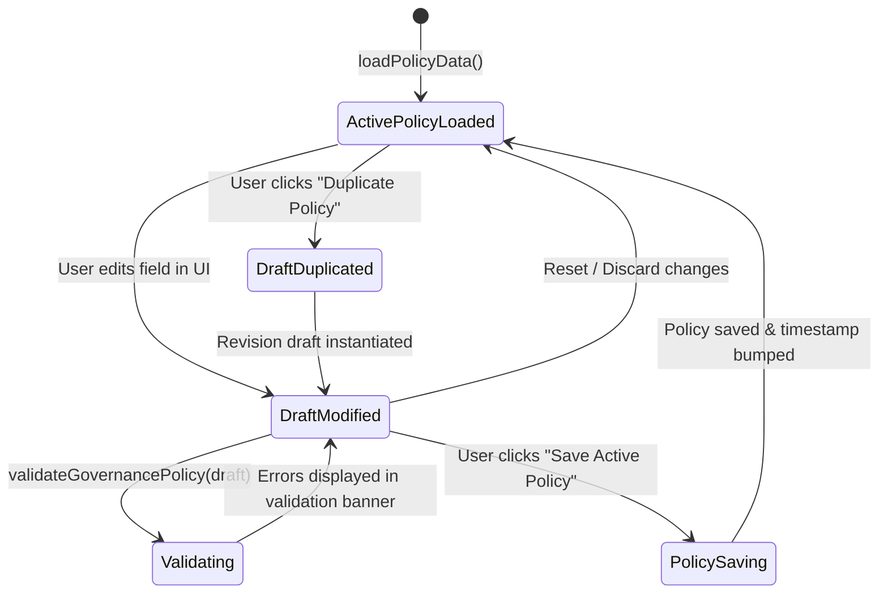

# INFUSE Frontend Architecture & Backend Integration Map

**Milestones:** Block 02 (Frontend Information / Execution Surface Hardening) & Block 03 (Frontend Governance / Policy Surface Hardening)  
**Status:** Frozen  
**Visual Baseline:** Stitch Console (`Autonomous Governance Obsidian` Theme)  
**Contract Baseline:** Block 00 Universal Contracts (`infuse.contracts.frontend`, `infuse.contracts.policy`)  

---

## 1. Overview

The INFUSE Frontend Console comprises two primary operational surfaces:
1. **Execution / Information Surface:** Glass-box operational telemetry view of real-time autonomous AI agent execution.
2. **Governance / Policy Surface:** User-facing control plane for defining execution envelopes, token ceilings, budget boundaries, and deterministic Governor action bindings.

Every displayed field, metric, status pill, chart, and timeline event is strictly mapped to normalized `ViewModels` delivered through the [`IDataProvider`](file:///Users/ssd/infuse/frontend/src/data/IDataProvider.js) interface, completely decoupled from database schemas and backend execution logic.

```text
┌────────────────────────────────────────────────────────────────────────┐
│                        INFUSE FRONTEND CONSOLE                         │
│                                                                        │
│  [Execution / Information Surface]       [Governance / Policy Surface] │
│  ├── Execution Context & Switcher        ├── Active Policy Overview    │
│  ├── Dedicated Execution State (5 States)├── 10 Policy Control Sections│
│  ├── 8-Card Metrics Grid (Tabular-nums)  │   (Budget, Tokens, Requests,│
│  ├── SVG Token Growth & Cost Time-Series │    Runtime, Providers, Web, │
│  ├── Web, Tool, File & Retry Activity    │    Tools, Retry, Anomaly,   │
│  ├── Central Governor Action Banner      │    Action Matrix)           │
│  ├── Provider & Model Health             ├── Draft & Dirty State Track │
│  ├── Traceable Event Timeline            ├── Client-side UX Validation │
│  ├── Runtime Engine Signal Inspector     └── Policy Revision Duplicate │
│  └── Filterable Execution History                                      │
└───────────────────────────────────┬────────────────────────────────────┘
                                    │
                                    ▼
                         IDataProvider Interface
                                    │
                   ┌────────────────┴────────────────┐
                   ▼                                 ▼
            MockDataProvider                 ApiDataProvider
            (Active in Blocks 01-03)         (Future Block 05)
                                                     │
                                                     ▼
                                            Universal HTTP API
                                            (/v1/executions, /v1/policies)
```

---

## 2. Execution Surface Component-to-Backend Integration Map

| # | Execution Section | Component | Frontend ViewModel | Future Backend Origin | API Route |
|---|---|---|---|---|---|
| **1** | **Execution Context Header** | [`ExecutionHeader.js`](file:///Users/ssd/infuse/frontend/src/components/ExecutionHeader.js) | `ExecutionSummaryViewModel` | Execution API & Lifecycle | `GET /v1/executions/{id}` |
| **2** | **Execution State** | [`StateSelector.js`](file:///Users/ssd/infuse/frontend/src/components/StateSelector.js) | `ExecutionStateViewModel` | Execution State Engine | `GET /v1/executions/{id}` |
| **3** | **Execution Metrics (8 Cards)** | [`MetricsGrid.js`](file:///Users/ssd/infuse/frontend/src/components/MetricsGrid.js) | `ExecutionMetricsViewModel` | Token Observer & Economics | `GET /v1/executions/{id}` |
| **4** | **Token Growth Time-Series** | [`Charts.js`](file:///Users/ssd/infuse/frontend/src/components/Charts.js) | `ExecutionMetricsViewModel` | Token Observer Stream | `GET /v1/executions/{id}` |
| **5** | **Cost Over Time Chart** | [`Charts.js`](file:///Users/ssd/infuse/frontend/src/components/Charts.js) | `ExecutionMetricsViewModel` | Economics Engine Stream | `GET /v1/executions/{id}` |
| **6** | **Execution Activity** | [`ActivityPanel.js`](file:///Users/ssd/infuse/frontend/src/components/ActivityPanel.js) | `ExecutionMetricsViewModel` | Tool & Web Observers | `GET /v1/executions/{id}` |
| **7** | **Governor Action Banner** | [`GovernorPanel.js`](file:///Users/ssd/infuse/frontend/src/components/GovernorPanel.js) | `GovernorDecisionViewModel` | Central Governor | `GET /v1/executions/{id}` |
| **8** | **Provider / Model Health** | [`HealthPanel.js`](file:///Users/ssd/infuse/frontend/src/components/HealthPanel.js) | `ProviderModelHealthViewModel`| Health Engine | `GET /v1/executions/{id}` |
| **9** | **Chronological Event Timeline**| [`Timeline.js`](file:///Users/ssd/infuse/frontend/src/components/Timeline.js) | `ExecutionTimelineEventViewModel`| Event Bus & Ledger | `GET /v1/executions/{id}/events` |
| **10**| **Runtime Engine Inspector** | [`RuntimeEngines.js`](file:///Users/ssd/infuse/frontend/src/components/RuntimeEngines.js)| `ExecutionMetricsViewModel` | Real-time Engine Observers | `GET /v1/executions/{id}` |
| **11**| **Execution History Table** | [`HistoryTable.js`](file:///Users/ssd/infuse/frontend/src/components/HistoryTable.js) | `ExecutionHistoryItemViewModel`| Execution History Store | `GET /v1/executions` |

---

## 3. Governance / Policy Surface Component-to-Backend Integration Map

| # | Policy Section | Component | Target Fields | Frontend ViewModel | Future Backend Origin | API Route |
|---|---|---|---|---|---|---|
| **1** | **Budget Controls** | [`PolicyForm.js`](file:///Users/ssd/infuse/frontend/src/components/PolicyForm.js) | `max_cost_per_task`, `max_cost_per_day`, `max_cost_per_month`, `currency`, `budget_action` | `GovernancePolicyViewModel` | Policy Engine / Economics | `GET, PUT /v1/policies/active` |
| **2** | **Token Controls** | [`PolicyForm.js`](file:///Users/ssd/infuse/frontend/src/components/PolicyForm.js) | `max_input_tokens`, `max_output_tokens`, `max_total_tokens`, `token_action` | `GovernancePolicyViewModel` | Policy Engine / Token Observer | `GET, PUT /v1/policies/active` |
| **3** | **Request Controls** | [`PolicyForm.js`](file:///Users/ssd/infuse/frontend/src/components/PolicyForm.js) | `max_rpm`, `max_requests_per_task`, `request_action` | `GovernancePolicyViewModel` | Policy Engine / Rate Limiter | `GET, PUT /v1/policies/active` |
| **4** | **Runtime Controls** | [`PolicyForm.js`](file:///Users/ssd/infuse/frontend/src/components/PolicyForm.js) | `max_execution_time_seconds`, `runtime_action` | `GovernancePolicyViewModel` | Policy Engine / Lifecycle | `GET, PUT /v1/policies/active` |
| **5** | **Provider & Model Access** | [`PolicyForm.js`](file:///Users/ssd/infuse/frontend/src/components/PolicyForm.js) | `allowed_providers`, `allowed_models`, `blocked_providers`, `blocked_models` | `GovernancePolicyViewModel` | Policy Engine / Provider Layer | `GET, PUT /v1/policies/active` |
| **6** | **Web Access Controls** | [`PolicyForm.js`](file:///Users/ssd/infuse/frontend/src/components/PolicyForm.js) | `enabled`, `max_web_requests_per_task`, `allowed_domains`, `blocked_domains` | `GovernancePolicyViewModel` | Policy Engine / Web Observer | `GET, PUT /v1/policies/active` |
| **7** | **Tool Access** | [`PolicyForm.js`](file:///Users/ssd/infuse/frontend/src/components/PolicyForm.js) | `enabled`, `max_tool_calls_per_task`, `max_consecutive_tool_failures`, `allowed_tools`, `blocked_tools` | `GovernancePolicyViewModel` | Policy Engine / Tool Observer | `GET, PUT /v1/policies/active` |
| **8** | **Retry Policy** | [`PolicyForm.js`](file:///Users/ssd/infuse/frontend/src/components/PolicyForm.js) | `max_retries`, `backoff_factor`, `retry_on_errors`, `fallback_provider_on_failure`, `provider_failure_action` | `GovernancePolicyViewModel` | Policy Engine / Retry Handler | `GET, PUT /v1/policies/active` |
| **9** | **Anomaly & Runaway Protection** | [`PolicyForm.js`](file:///Users/ssd/infuse/frontend/src/components/PolicyForm.js) | `token_velocity_surge_threshold`, `repetitive_loop_threshold`, `circuit_breaker_enabled`, `anomaly_action` | `GovernancePolicyViewModel` | Policy Engine / Anomaly Detector | `GET, PUT /v1/policies/active` |
| **10**| **Policy Action Matrix** | [`PolicyForm.js`](file:///Users/ssd/infuse/frontend/src/components/PolicyForm.js) | Explanatory trigger conditions to bound Governor canonical actions | `GovernancePolicyViewModel` | Policy Engine / Governor Matrix | `GET /v1/policies/active` |

---

## 4. Canonical States & Governor Actions Supported

### 4.1 Execution States
1. `NORMAL`: Standard operation within policy parameters.
2. `COST_PRESSURE`: Cost approaching budget pacing boundary (automated optimization engaged).
3. `RUNAWAY`: Recursive loop or anomalous token surge detected (circuit breaker halt).
4. `QUALITY_DEGRADED`: Output drift or schema validation failures (model tier escalation).
5. `PROVIDER_CONSTRAINED`: Provider rate limits (HTTP 429) or high latency (dynamic route switching).

### 4.2 Canonical Governor Actions
1. `CONTINUE`: Standard unthrottled execution.
2. `OPTIMIZE`: Context compression & semantic caching.
3. `ESCALATE`: Model tier elevation.
4. `DOWNGRADE`: Route to lower-cost tier for subsequent steps.
5. `SWITCH`: Failover to backup provider.
6. `THROTTLE`: Rate-limit request pacing.
7. `STOP`: Hard circuit-breaker termination.

---

## 5. Governance Form Lifecycle & State Management



* **Dirty / Unsaved State Tracking:** Tracks modifications relative to the baseline loaded policy, updating header badges ("Unsaved Draft") and enabling the "Reset Changes" button.
* **Client-Side UX Validation:** Validates numerical non-negativity, logical relationships (e.g., `max_total_tokens >= max_input_tokens`), minimum positive values for rates/times, and canonical action membership without duplicating backend enforcement rules.
* **Provider Neutrality:** The frontend surface defines allowlists and blocklists only; it does not execute provider ranking, scoring, or autonomous selection algorithms.
